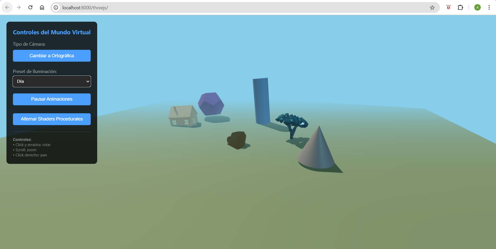
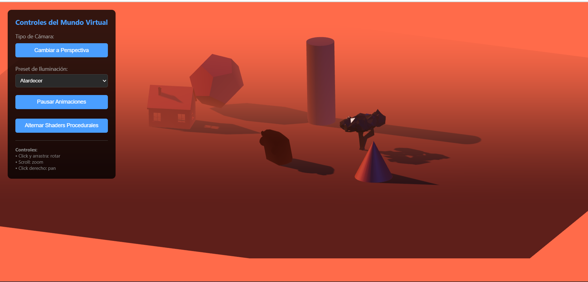
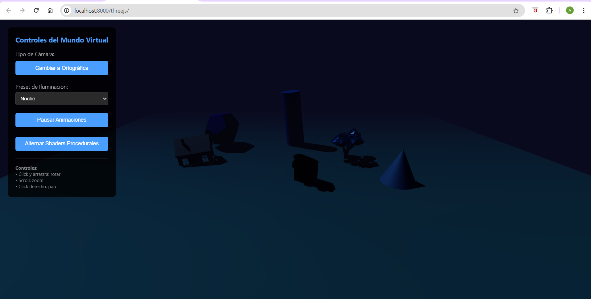
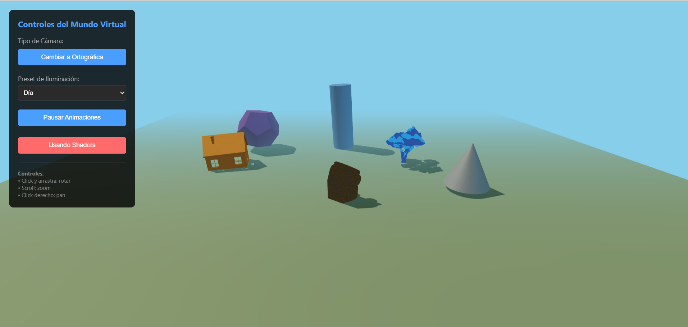

# Taller 1: Materiales, Iluminación y Color - Three.js

Este proyecto es un mundo virtual interactivo que demuestra cómo la iluminación y los materiales PBR transforman la apariencia de objetos 3D en tiempo real.


---

## Descripción

Una galería interactiva donde puedes experimentar con diferentes configuraciones de iluminación, alternar entre materiales físicamente basados y shaders procedurales, y cambiar entre proyecciones de cámara. Incluye tres modelos GLB (árbol, casa, coche) más tres primitivas, cada uno con propiedades únicas de materiales.

## Capturas de la Escena

### Iluminación de Día - Cámara Perspectiva

*Iluminación natural con luz cálida principal y relleno azul cielo. Los materiales metálicos muestran reflexiones claras.*

### Iluminación de Atardecer - Cámara Ortográfica

*Golden hour con tonos naranjas dominantes. La proyección ortográfica mantiene proporciones reales sin distorsión perspectiva.*

### Iluminación Nocturna - Detalle

*Tonos fríos azulados con luz de contorno púrpura. Los materiales semi-metálicos reflejan sutilmente la iluminación artificial.*

### Comparación: Materiales PBR vs Shaders Procedurales

*Izquierda: Materiales físicamente basados que responden correctamente a toda la iluminación. Derecha: Shaders procedurales con texturas generadas matemáticamente.*

---

## Objetos Implementados

**Árbol (Modelo GLB - Orgánico)**
- Material azul metálico brillante (roughness 0.2, metalness 0.8)
- Shader procedural de damero
- Animación: rotación continua

**Casa (Modelo GLB - Arquitectónico)**
- Material naranja mate (roughness 0.7, metalness 0.1)
- Shader procedural de bandas animadas
- Animación: balanceo sutil

**Coche (Modelo GLB - Utilitario)**
- Material amarillo semi-metálico (roughness 0.4, metalness 0.6)
- Shader procedural de ruido
- Animación: rotación multi-eje

**Cilindro, Cono, Dodecaedro**
- Primitivas con diferentes configuraciones de materiales
- Animaciones variadas: balanceo, flotación, órbita

---

## Sistema de Iluminación

Esquema profesional de tres puntos más luz ambiental:

**Key Light:** Luz principal direccional que define formas y proyecta sombras dinámicas.

**Fill Light:** Luz secundaria que suaviza sombras y añade información visual en áreas oscuras.

**Rim Light:** Luz puntual que orbita la escena, separando objetos del fondo y añadiendo profundidad.

**Ambient Light:** Luz global uniforme que evita sombras completamente negras.

### Presets Disponibles

**Día:** Luz cálida principal con relleno azul cielo. Simula mediodía con cielo despejado.

**Atardecer:** Golden hour con luz naranja intensa y sombras azuladas. El momento más dramático del día.

**Noche:** Tonos fríos dominantes que simulan iluminación artificial o luz de luna.

---

## Materiales y Shaders

**Materiales PBR:** Físicamente basados con parámetros configurables de roughness (rugosidad) y metalness (metalicidad). Responden correctamente a toda la iluminación de la escena siguiendo leyes físicas reales.

**Shaders Procedurales:** Tres tipos implementados:
- Damero: Patrón de cuadrícula para verificar mapeo UV
- Bandas: Ondas sinusoidales animadas temporalmente
- Ruido: Función pseudo-aleatoria que simula texturas naturales

Puedes alternar en tiempo real entre ambos sistemas para comparar el renderizado físico con efectos artísticos.

---

## Cámaras

**Perspectiva (FOV 60°):** Simula visión humana con punto de fuga. Los objetos lejanos aparecen más pequeños. Ideal para navegación inmersiva y dramatismo visual.

**Ortográfica (Frustum 20 unidades):** Proyección paralela sin distorsión. Mantiene proporciones reales independientemente de la distancia. Perfecta para análisis técnico y diseño arquitectónico.

Cambio instantáneo entre ambas proyecciones manteniendo la posición de la cámara.

---

## Controles

**Ratón:**
- Click izquierdo + arrastrar: Orbitar cámara alrededor de la escena
- Scroll: Zoom in/out
- Click derecho + arrastrar: Desplazar vista (pan)

**Panel de Control:**
- Tipo de Cámara: Alterna entre perspectiva y ortográfica
- Preset de Iluminación: Cambia entre día, atardecer y noche
- Pausar Animaciones: Congela todo movimiento para análisis
- Alternar Shaders: Cambia entre materiales PBR y shaders procedurales

---

## Ejecución

El proyecto requiere un servidor HTTP local para cargar módulos ES6 y archivos GLB.

**Con Python:**
```bash
python -m http.server 8000
# Abre http://localhost:8000/threejs/
```

**Con Node.js:**
```bash
npx http-server -p 8000
# Abre http://localhost:8000/threejs/
```

**Con VS Code:**
Instala la extensión "Live Server" y abre index.html con click derecho.

---

## Modelos GLB

Los tres modelos necesarios están incluidos en `glb_models/`:
- tree.glb - Modelo orgánico natural
- house.glb - Estructura arquitectónica
- car.glb - Objeto utilitario funcional

Fuentes: Poly Pizza (poly.pizza), modelos bajo licencia CC0.

El cargador GLB implementa fallback automático a geometrías primitivas si algún modelo no puede cargarse.

---

## Especificaciones Técnicas

- **Objetos 3D:** 6 totales (3 GLB + 3 primitivas)
- **Sistema de luces:** 4 (ambient, key, fill, rim)
- **Shaders procedurales:** 3 tipos implementados
- **Cámaras:** 2 con alternancia instantánea
- **Presets de iluminación:** 3 configuraciones completas
- **Sombras dinámicas:** Resolución 2048x2048
- **Framework:** Three.js r160
- **Rendimiento objetivo:** 60 FPS

---

## Paleta de Color

Esquema complementario dividido con azules como color primario (200-220°) y naranjas-amarillos como acentos (30-40°). Los colores están definidos en HSV y convertidos a RGB.

El contraste perceptual analizado en espacio CIELAB asegura diferenciación visual de Delta E ≈ 70 entre colores principales, garantizando alta visibilidad incluso bajo cambios drásticos de iluminación.

---

## Estructura del Proyecto

```
2025-10-02_taller_1_materiales_iluminacion_color/
├── README.md              # Este archivo
├── INICIO_RAPIDO.md       # Guía de inicio rápida
│
├── threejs/
│   └── index.html         # Escena principal con cargador GLB
│
├── glb_models/
│   ├── tree.glb
│   ├── house.glb
│   └── car.glb
│
├── renders/
│   ├── day_perspective.png
│   ├── sunset_orthographi.png
│   ├── night_closeup.png
│   ├── shader_comparison.png
│   └── animation.gif
│
└── textures/
   
```

---

## Aprendizajes Clave

**La iluminación define la percepción:** El mismo material se ve completamente diferente bajo distintas condiciones de luz. La temperatura de color, intensidad y dirección son tan importantes como las propiedades del material.

**PBR vs Shaders:** Los shaders procedurales ofrecen control artístico total pero requieren implementar iluminación manualmente. Los materiales PBR garantizan resultados físicamente correctos pero son menos flexibles creativamente.

**Proyección de cámara:** La elección entre perspectiva y ortográfica cambia radicalmente la percepción espacial. La perspectiva añade profundidad dramática, la ortográfica mantiene proporciones precisas.

**Espacios de color:** Trabajar en HSV facilita la creación de paletas armoniosas, pero el análisis en CIELAB asegura contrastes perceptualmente significativos bajo cualquier iluminación.

---

## Referencias

- Three.js Documentation: threejs.org/docs
- PBR Theory (Marmoset): marmoset.co/posts/basic-theory-of-physically-based-rendering
- CIELAB Color Space: en.wikipedia.org/wiki/CIELAB_color_space
- Poly Haven (Assets): polyhaven.com

---

**Proyecto desarrollado para el curso de Computación Gráfica**  
**Octubre 2025**

Ver INICIO_RAPIDO.md para instrucciones de ejecución inmediata.
