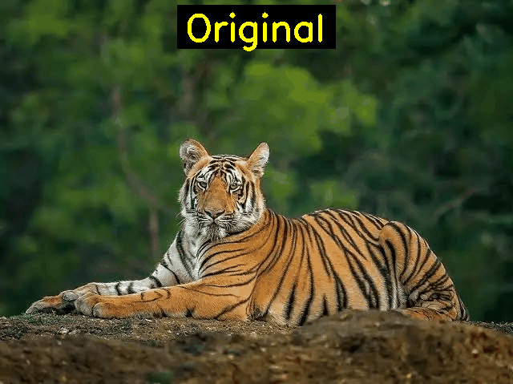

# Examen Final - Computación Visual

**Estudiante:** John Andres Rua Cortes 
**Fecha:** 03 Diciembre 2025

---

## 📋 Contenido

1. [Punto 1 - Procesamiento de Imágenes en Python](#punto-1---procesamiento-de-imágenes-en-python)
2. [Punto 2 - Escena 3D con Three.js](#punto-2---escena-3d-con-threejs)
3. [Instrucciones de Ejecución](#instrucciones-de-ejecución)

---

## 🐯 Punto 1 - Procesamiento de Imágenes en Python

### Descripción

Este examen implementa técnicas avanzadas de procesamiento digital de imágenes aplicadas a una fotografía de un animal en vía de extinción. Se utilizan librerías como OpenCV, NumPy, Matplotlib y PIL para realizar diversas transformaciones y análisis de la imagen.

### Técnicas Implementadas

1. **Carga y visualización de imagen RGB**
   - Lectura de imagen desde archivo
   - Conversión de espacio de color BGR a RGB

2. **Filtros básicos**
   - **Suavizado Gaussiano:** Reduce el ruido y suaviza los detalles finos, creando una apariencia más difuminada
   - **Detección de bordes (Canny):** Resalta los contornos principales del animal, ideal para análisis de formas

3. **Visualización de canales de color**
   - Separación de los canales R, G, B
   - Análisis individual de cada canal en escala de grises
   - Identificación de estructuras según su contenido cromático

4. **Operaciones morfológicas**
   - **Erosión:** Adelgaza estructuras y elimina ruido pequeño
   - **Dilatación:** Expande estructuras y rellena huecos

5. **Generación de animación GIF**
   - Secuencia de 6 frames mostrando todas las transformaciones
   - Duración: 1.5 segundos por frame

### Resultados Visuales

**GIF: Procesamiento completo de la imagen**



*La animación muestra la secuencia: Original → Suavizado → Detección de Bordes → Binarización → Erosión → Dilatación*

### Análisis de Canales RGB

El análisis de los canales de color revela información importante:

- **Canal Rojo:** Las áreas con tonos naranjas/rojizos del pelaje aparecen más brillantes
- **Canal Verde:** La vegetación del fondo se destaca, útil para segmentación
- **Canal Azul:** Generalmente contiene menos información en imágenes de fauna terrestre

### Aplicaciones Prácticas

Estas técnicas son fundamentales en:
- Conservación de especies (identificación de patrones individuales)
- Visión por computadora (detección y seguimiento de animales)
- Investigación biológica (análisis morfológico)

---

## 🎮 Punto 2 - Escena 3D con Three.js

### Descripción

Escena 3D interactiva que presenta una composición de formas geométricas básicas con animaciones continuas, texturas procedurales, sistema de iluminación dual y controles de cámara avanzados.

### Características Implementadas

#### 1. **Formas Geométricas (7 objetos)**
- **Cubos:** Con textura de tablero de ajedrez y ladrillos
- **Esfera:** Con textura de ladrillos
- **Cono:** Material colorido (rojo) con propiedades metálicas
- **Cilindro:** Textura de tablero de ajedrez
- **Toro:** Material metálico turquesa
- **Octaedro:** Material amarillo metálico

Todas las formas están organizadas en una composición equilibrada que simula una "escultura 3D".

#### 2. **Sistema de Cámaras (2 perspectivas)**
- **Vista 1:** Perspectiva frontal elevada (15, 10, 15)
- **Vista 2:** Perspectiva lateral elevada (-10, 15, 10)

**Cambio de perspectiva:**
- Botones en el panel de control
- Teclas `1` y `2` del teclado
- Transición animada suave entre vistas

#### 3. **Animaciones Continuas**
- Cada forma geométrica tiene rotaciones únicas en diferentes ejes
- Velocidades de rotación personalizadas para crear dinamismo
- Animación fluida a 60 FPS

#### 4. **Texturas (2 tipos principales)**
- **Textura de tablero de ajedrez:** Patrón blanco y negro generado proceduralmente
- **Textura de ladrillos:** Patrón de ladrillos marrones generado proceduralmente
- **Textura de piso:** Grid pattern para referencia espacial

Todas las texturas se generan mediante Canvas 2D (sin archivos externos).

#### 5. **Sistema de Iluminación (3 luces)**
- **Luz direccional:** Simula luz solar, proyecta sombras suaves
- **Luz puntual:** Iluminación de acento color turquesa, con esfera visible
- **Luz ambiental:** Iluminación general suave

#### 6. **OrbitControls**
- **Rotación:** Click izquierdo + arrastrar
- **Zoom:** Rueda del mouse
- **Paneo:** Click derecho + arrastrar
- Amortiguación suave (damping) para movimientos naturales
- Límites de distancia: 5 - 50 unidades

### Resultados Visuales

**GIF: Escena completa con animaciones**


*Múltiples formas geométricas con texturas y animaciones continuas*


### Detalles Técnicos

- **Renderizador:** WebGL con antialiasing
- **Sombras:** PCF Soft Shadows para mayor realismo
- **Niebla:** Atmosférica para profundidad (20-50 unidades)
- **Responsive:** Se adapta al tamaño de la ventana
- **Performance:** Optimizado para 60 FPS

---

## 🚀 Instrucciones de Ejecución

### Punto 1 - Python

#### Requisitos
```bash
pip install opencv-python numpy matplotlib pillow
```

#### Ejecución

1. **Preparar la imagen:**
   - Descarga una imagen de un animal en vía de extinción (Ya se incluye)
   - Guárdala como `python/data/animal_extincion.jpg`


2. **Ejecutar el notebook:**
   ```bash
   cd examen_final/python
   jupyter notebook examen_final_python.ipynb
   ```

3. **Ejecutar las celdas:**
   - Ejecuta todas las celdas en orden (Cell → Run All)
   - El GIF se generará automáticamente en `python/gifs/procesamiento_imagen.gif`

#### Alternativa sin imagen
Si no tienes una imagen, el notebook generará una imagen de ejemplo automáticamente para demostración.

### Punto 2 - Three.js

#### Requisitos
- Navegador web moderno (Chrome, Firefox, Edge, Safari)
- Servidor HTTP local

#### Opción 1: Python HTTP Server
```bash
cd examen_final/threejs
python -m http.server 8000
```
Luego abre `http://localhost:8000` en tu navegador.

#### Opción 2: Node.js HTTP Server
```bash
cd examen_final/threejs
npx http-server -p 8000
```
Luego abre `http://localhost:8000` en tu navegador.

#### Opción 3: VS Code Live Server
1. Instala la extensión "Live Server"
2. Click derecho en `index.html`
3. Selecciona "Open with Live Server"

### Controles de la Escena

- **Rotar cámara:** Click izquierdo + arrastrar
- **Zoom:** Rueda del mouse
- **Mover cámara:** Click derecho + arrastrar
- **Cambiar vista:** Botones "Vista 1" / "Vista 2" o teclas `1` / `2`

---

## 📁 Estructura del Proyecto

```
examen_final/
├── python/
│   ├── examen_final_python.ipynb    # Notebook principal
│   ├── data/
│   │   └── animal_extincion.jpg     # Imagen de entrada (agregar)
│   └── gifs/
│       └── procesamiento_imagen.gif # GIF generado
├── threejs/
│   ├── index.html                   # Página principal
│   ├── src/
│   │   └── main.js                  # Código Three.js
│   ├── textures/                    # (Vacío - texturas generadas proceduralmente)
│   └── gifs/
│       └── escena_completa.gif       
└── README.md                        # Este archivo
```

---


## 🎓 Conclusión

Este examen demuestra el dominio de técnicas fundamentales en computación visual:

- **Procesamiento de imágenes:** Filtros, transformaciones, operaciones morfológicas
- **Gráficos 3D:** Modelado, texturizado, iluminación, animación e interacción
- **Programación visual:** Python (OpenCV) y JavaScript (Three.js)

Ambos componentes trabajan en conjunto para mostrar las capacidades del procesamiento visual tanto en 2D como en 3D.
